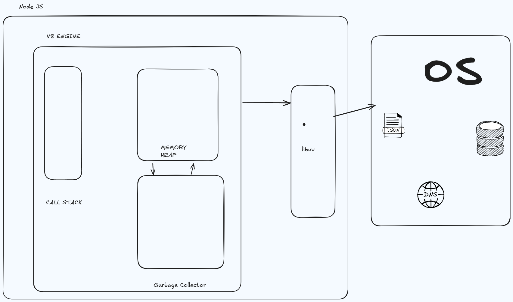

# Synchronous vs Asynchronous Operations

## Synchronous (Blocking)
- Executes code line by line
- Each operation must complete before moving to next line
- Blocks execution until task is complete
- Single-threaded behavior
- Easier to understand and debug

## Asynchronous (Non-Blocking)
- Operations can run in parallel
- Doesn't block code execution
- Uses callbacks, promises, or async/await
- Better performance for I/O operations
- Common in Node.js applications

### Example:
```javascript
// Synchronous
const data = fs.readFileSync('file.txt');
console.log(data);

// Asynchronous
fs.readFile('file.txt', (err, data) => {
    console.log(data);
});
```

