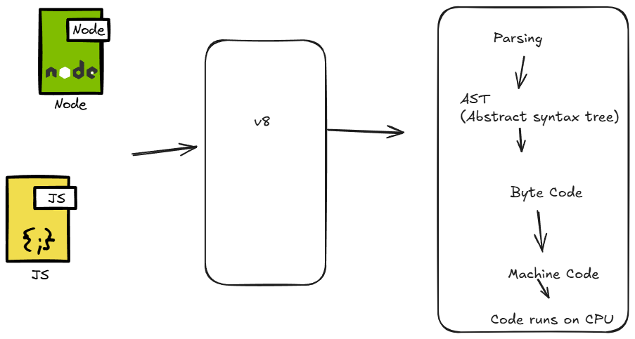

Parsing

// Source code
function add(a, b) {
    return a + b;
}

The process works like this:

1. **Scanner** breaks it into tokens:
   - `function` (keyword)
   - `add` (identifier)
   - `(` (punctuator)
   - `a` (identifier)
   - `,` (punctuator)
   - `b` (identifier)
   - `)` (punctuator)
   - `{` (punctuator)
   - `return` (keyword)
   - etc.

2. **Parser** creates AST:
   - Function Declaration node
   - Parameters list node
   - Return statement node
   - Binary operation node (+)

Key Points:
- V8 uses **lazy parsing** for efficiency - only fully parses code that's about to execute
- **Pre-parsing** scans for syntax errors and scope information without creating full AST
- The AST is then used by the **Ignition interpreter** to generate bytecode

This process is the first step in V8's compilation pipeline before moving to bytecode generation and optimization.

2.Ignition(Interpreter)
Let me explain the concept of Ignition in JavaScript engines, particularly in V8 (used by Chrome and Node.js).

# Ignition - The V8 JavaScript Interpreter

Ignition is V8's bytecode interpreter, serving as a crucial component in JavaScript execution. Here's a breakdown of its role:

## Key Points:

1. **Bytecode Generation**
   - Converts JavaScript code into bytecode
   - Acts as an intermediate representation between source code and machine code

2. **Performance Benefits**
   - Reduces memory usage compared to full machine code
   - Enables faster startup time
   - Serves as a baseline for optimization decisions

3. **Pipeline Position**
   ```text
   JavaScript Source → Parser → Ignition (Bytecode) → TurboFan (Optional JIT)
   ```

## How It Works:

- When JavaScript code is loaded, Ignition first converts it to bytecode
- Executes this bytecode directly while collecting profiling data
- Works with TurboFan (the optimizing compiler) to identify hot code paths
- Manages the transition between interpreted and optimized code

## Advantages:

- Lower memory footprint than direct JIT compilation
- Faster initial execution start
- Better performance on mobile devices
- Provides foundation for further optimizations

Ignition represents a balance between pure interpretation and full compilation, making JavaScript execution both efficient and resource-friendly.

# 3. Garbage Collection in V8

V8's garbage collector is responsible for automatic memory management. Here's how it works:

## Main Components:

1. **Minor GC (Scavenger)**
    - Handles young/new objects
    - Fast and frequent collection
    - Uses Cheney's copying algorithm

2. **Major GC (Mark-Sweep-Compact)**
    - Manages old space objects
    - More thorough but less frequent
    - Three phases: marking, sweeping, compaction

## Key Features:

- **Generational Collection**: Objects are divided into young and old generations
- **Incremental Processing**: Splits GC work into smaller chunks
- **Concurrent Processing**: Runs some GC tasks parallel to JavaScript execution
- **Marking**: Identifies and marks live objects
- **Write Barriers**: Tracks cross-generational references

## Memory Spaces:

```text
New Space → Old Space → Large Object Space
```

The garbage collector ensures efficient memory usage while minimizing application pauses.